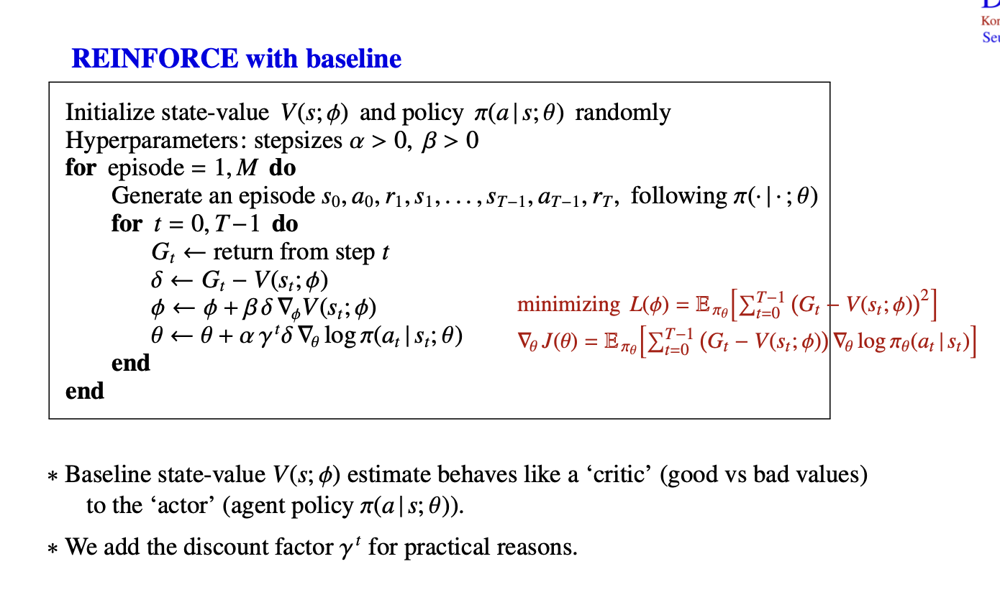
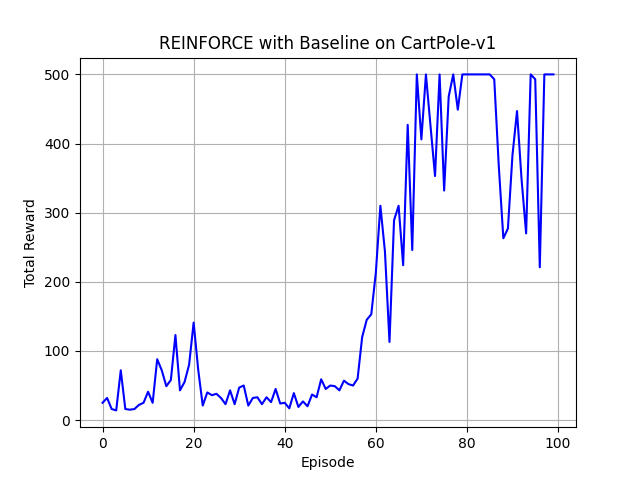
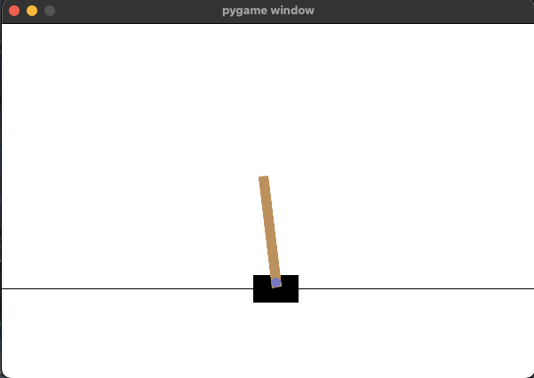
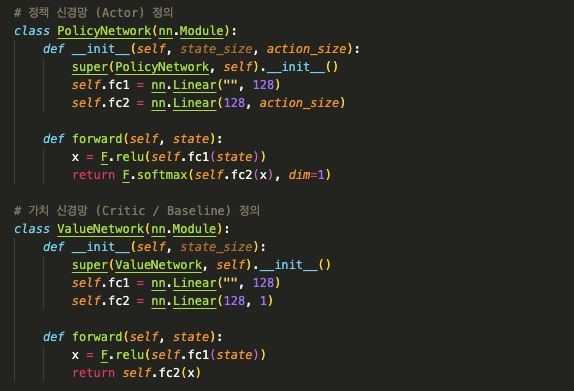
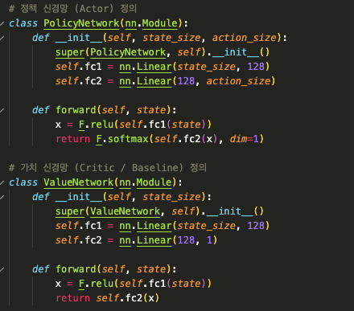

# REINFORCE
```bash
conda create -n reinforce python==3.10
git clone https://github.com/Hands-on-study/REINFORCE.git
git checkout "change your branch name!!"
pip3 install -r requirements.txt
``` 
REINFORCE 



1. state value & policy를 초기
2. $\pi$를 이용해서 에피소드를 생성
3. G(Return)에서 V(s) 뺄셈 → 해당 state가 좋은지 나쁜지를 value 값으로 확인
4. $\phi$의 업데이트를 통해 V(s)가 G와 근사해지게끔 학습
5. $\theta$의 업데이트를 통해 $\delta$가 + 인 경우 해당 action에 대한 prob를 높이고, 반대의 경우 prob를 낮추는 방향으로 학습(gradient ascent)
   
## Quiz

### Policy Gradient

REINFORCE는 Policy Gradient 알고리즘의 한 종류입니다. Policy Gradient는 Policy 그 자체를 매개변수화하고, 
**경사 상승법(gradient ascent)**을 이용해 누적 보상을 최대화하는 방향으로 정책 매개변수를 직접 업데이트하는 방법입니다. 

### Q1. 

REINFORCE와 DQN의 차이점은 무엇인가?

1. REINFORCE는 **policy-based 방법**이고, DQN은 **value-based 방법**이다.
2. REINFORCE는 경험을 **리플레이 메모리**에 저장해 학습하고, DQN은 샘플 효율성을 위해 **에피소드 전체 리턴**을 이용한다.
3. REINFORCE는 action-value 함수 Q(s,a)를 근사하고, DQN은 policy \pi(a|s)를 직접 근사한다.
4. REINFORCE는 deterministic policy를 학습하고, DQN은 stochastic policy를 학습한다.
5. REINFORCE와 DQN은 모두 on-policy 방법이므로, 경험 재사용은 불가능하다.


### Q2. 

Policy gradient 관점에서 바라보았을 때 아래 수식의 성립 여부에 대해 성립/불성립을 선택하고 선택에 대한 이유를 한 줄로 간략히 설명하시오.

<aside>
💡

$\pi_{\theta_1}$ ≠ $\pi_{\theta_2}$

</aside>


### Q3. 

REINFORCE 알고리즘은 에피소드가 **끝난 후**에 파라미터를 업데이트한다. 이로 인해 발생하는 주요 단점은 무엇인가?



### Q4.

Q3의 문제를 해결하기 위해서 도입한 주요 개념은 무엇인가?

1. Experience Replay buffer
2. value iteration
3. Policy entropy
4. Baseline
5. Temporal Diffrence Error

### Q5. 



아래 이미지와 같이 빈칸 처리 된 부분을 채워넣고, quiz_Cartpole-REINFORCE.py 코드를 실행시켜 Cartpole network를 최적화 하시오.

quiz


answer


## git push
```bash
git checkout -b your-branch-name
# 예: git checkout -b pan

git add .
git commit -m "message"
# 예: git commit -m "Add solution by pan"

git push origin your-branch-name
# 예: git push origin pan
```
